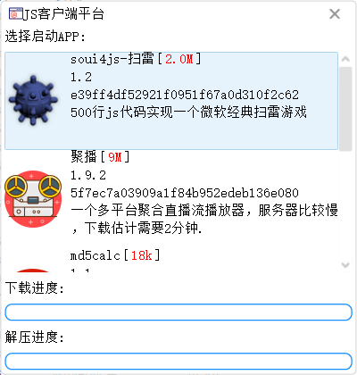

# soui4js-host使用方法
+ soui4js-host是一个使用soui4js的示例，你可以认为它是一个PC版的小程序，默认参数下soui4js-host从服务器下载一个小程序列表，双击列表中的js小程序，会自动下载程序包（js+xml资源包）并解压运行。
+ 这里提供了3个bat程序，run_host.bat, run_host_x64.bat分别启动32位及64位版本的soui4js-host, 小程序列表中有一个直播播放器，由于没有编译64位的播放器内核，只在32位版本中可以看到。
	- run_host.bat 启动32位版本的soui4js-host, 小程序列表中有一个直播播放器，由于没有编译64位的播放器内核，只在32位版本中可以看到。
	- run_host_x64.bat 启动64位版本的soui4js-host
	- run_wizard.bat 启动soui4js开发向导。向导支持创建一个新的soui4js程序框架，建议使用前先安装vscode并安装插件quickjs-debugger。

# soui4js 模块介绍
+ qjsbind: 在duijs仓库的jsbind基础上改写的导出soui模块到js的bind库，目前基本满足了这个项目的需求，但是代码还不够优雅，欢迎高手继续优化。
+ soui4js：这是本项目的核心模块，依赖qjsbind，将soui4的用户接口层模块全部导出到js空间。
+ depends: 这是soui4js的依赖库
	* quickjs 是作者修改后的quickjs版本，源代码：https://github.com/soui4js/quickjs 分支：soui4js
	* soui4,  soui5.0.0.1的预编译。源代码：https://github.com/soui4/soui, 注意开源协议（商用收费）

# 博客
## https://www.cnblogs.com/setoutsoft

# GIT
## https://github.com/soui4js/soui4js

# 编译
+ 先获取子模块：git submodule update --init

## windows
使用cmake生成项目文件即可。

## Linux
先安装openssl，再使用cmake编译
sudo apt install libssl-dev